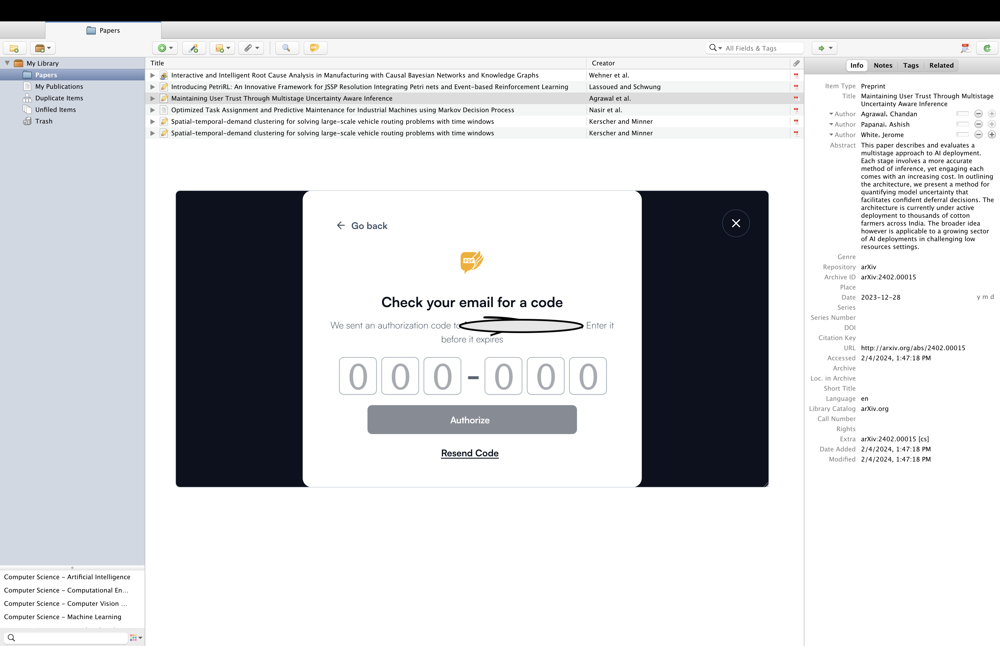
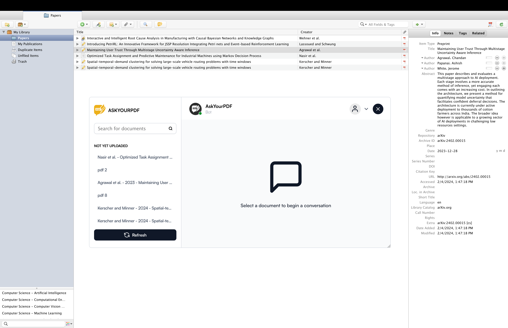

# AskYourPDF - Intelligent AI Research Assistant for Zotero
AskYourPDF is a Zotero extension that allows you to query your Zotero documents using various AI models such as GPT4, Claude and Mixtral

](assets/videos/chat_interface.gif)

## Installation

- Download the latest release (.xpi file) from GitHub: https://github.com/AskYourPdf/zotero_plugin/releases/download/1.0.0/askyourpdf.xpi
- In Zotero select <em>Tools</em> from the top menu bar, and then click on <em>Addons</em>.
- On the Add-ons Manager panel, click the gear icon at the top right corner and select <em>Install Add-on From File</em>
- Select the .xpi file you just downloaded and click <em>Open</em> which will start the installation process.

## Quickstart

Simple click on the AskYourPDF extension after installation and then select the file(s) you want to chat with on your Zotero account 

## Features

### Access to Various State of the Art AI Models

](assets/videos/feature_model_selection.gif)

## AskYourPDF and GPT Requirements

- Currently, AskYourPDF supports Zotero 6 and 7.
- AskYourPDF account is required

## Troubleshooting

 If you encounter any issues with Zotero, please do not hesitate to email us at [support@askyourpdf.com](mailto:support@askyourpdf.com) for assistance.